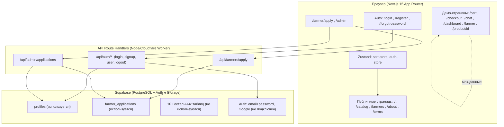
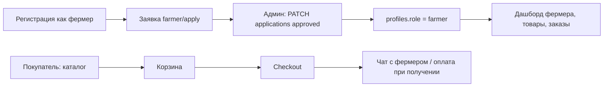

# Ferma.kz — Полный анализ проекта и текущего состояния

> Документ составлен автоматически после детального изучения всех 47 файлов репозитория
> `/Users/vega/dev/ferma-kz` (ветка `master`, рабочее дерево чистое).
> Дата анализа: 22.09.2026.

---

## Оглавление

1. [Обзор проекта](#1-обзор-проекта)
2. [Технический стек](#2-технический-стек)
3. [Структура репозитория](#3-структура-репозитория)
4. [Корневые конфигурационные файлы](#4-корневые-конфигурационные-файлы)
5. [Деплой и CI/CD](#5-деплой-и-cicd)
6. [База данных Supabase (полный текст схем)](#6-база-данных-supabase)
7. [Точка входа приложения](#7-точка-входа-приложения)
8. [Глобальные стили](#8-глобальные-стили)
9. [Supabase-клиенты и middleware](#9-supabase-клиенты-и-middleware)
10. [Страницы приложения (подробно)](#10-страницы-приложения)
11. [API-роуты (подробно)](#11-api-роуты)
12. [Компоненты](#12-компоненты)
13. [Сторы (Zustand)](#13-сторы-zustand)
14. [Типы TypeScript](#14-типы-typescript)
15. [Текущее состояние: что реально работает](#15-текущее-состояние)
16. [Расхождения: код ↔ SQL-схема ↔ README](#16-расхождения)
17. [Баги и технические проблемы](#17-баги-и-технические-проблемы)
18. [Мёртвый код и неиспользуемое](#18-мёртвый-код-и-неиспользуемое)
19. [Безопасность](#19-безопасность)
20. [Рекомендуемый roadmap развития](#20-recommendation)
21. [Приложение: текстовый контент страниц](#21-приложение)

---

## 1. Обзор проекта

**Ferma.kz** — маркетплейс фермерских продуктов для прямых продаж «от фермера к покупателю»
в Актобе, Казахстан. Позиционирование: «Свежие фермерские продукты напрямую, без посредников».

**Целевые аудитории (3 роли):**
- **Покупатель (customer)** — смотрит каталог, добавляет в корзину, оформляет заказ, пишет фермерам в чат.
- **Фермер (farmer)** — подаёт заявку на модерацию администратором, после одобрения управляет товарами и заказами.
- **Админ (admin)** — модерация заявок фермеров, управление пользователями/заказами/акциями.

**Бизнес-логика (по условиям использования):**
- Платформа не участвует в финансовых расчётах — оплата напрямую фермеру при получении.
- Цены устанавливает фермер; условия доставки обсуждаются индивидуально.
- Монетизация фермеров предполагается через подписки (`farmer_subscriptions`: тарифы, лимит товаров).
- Реферальная программа: 500 ₸ на первый заказ друга (таблица `referrals`, страница `/dashboard/referrals`).
- Подписки на еженедельные корзины (таблица `subscriptions`, страница `/dashboard/subscriptions`).
- XP/уровни для покупателей (поля `xp`, `level` в profiles; карточка «Опыт» в дашборде).

**Автор:** Nuraly, 15 лет, Актобе, Казахстан. Репозиторий: `nuralyga07-netizen/ferma-kz`.

**Общее состояние:** проект находится на стадии **демо/прототипа с частично реальной бэкенд-интеграцией**.
- ✅ Реально работает: аутентификация (регистрация/вход/выход), подача заявки фермера, API для админ-модерации заявок.
- ⚠️ Всё остальное (каталог, карточка товара, корзина, чек-аут, чат, дашборды, админ-панель) — **вёрстка на мок-данных**, захардкоженных в компонентах.
- База данных спроектирована широко (12 таблиц), но реально используются только 2: `profiles` и `farmer_applications`.

---

## 2. Технический стек

| Слой | Технология | Версия (из [`package.json`](package.json:1)) |
|---|---|---|
| Фреймворк | Next.js (App Router) | 15.5.19 |
| Язык | TypeScript | ^5 (strict) |
| UI-библиотека | React | 19.1.0 |
| Стили | Tailwind CSS v4 | ^4 (через `@tailwindcss/postcss`) |
| Анимации | Framer Motion | ^12.42.2 |
| Иконки | lucide-react | ^1.24.0 |
| Состояние | Zustand (+ persist) | ^5.0.14 |
| Тосты | sonner | ^2.0.7 |
| Валидация | zod | ^4.4.3 |
| CSS-утилиты | clsx + tailwind-merge + class-variance-authority | — |
| БД / Auth | Supabase (`@supabase/ssr` + `@supabase/supabase-js`) | ^0.6.0 / ^2.110.2 |
| Сборка под Cloudflare | `@opennextjs/cloudflare` + `wrangler` | ^1.20.1 / ^4.106.0 |
| Lint | ESLint 9 (flat config, `next/core-web-vitals`) | ^9 |
| Node | 22 | [`.node-version`](.node-version:1) (формат файла некорректен — см. §17) |

**Скрипты npm:**
```bash
npm run dev          # next dev
npm run build        # next build
npm run start        # next start
npm run lint         # eslint
npm run cf:build     # opennextjs-cloudflare build
npm run preview      # cf build + local preview (Cloudflare)
npm run deploy       # cf build + wrangler deploy (Cloudflare)
```

> ⚠️ В [`README.md`](README.md:38) написано «Next.js 16», хотя в package.json стоит Next.js 15.5.19.
> В README деплой описан через Vercel, но в репозитории настроен **двойной деплой: Vercel + Cloudflare**.

---

## 3. Структура репозитория

```
ferma-kz/
├── .env.local.example          # шаблон переменных окружения
├── .gitignore
├── .node-version               # "node-version=22" (некорректный формат)
├── eslint.config.mjs           # flat config via FlatCompat
├── farmer-applications.sql     # SQL-миграция: таблица заявок фермеров
├── next.config.ts              # images remotePatterns **; serverActions body 10mb
├── open-next.config.ts         # конфиг OpenNext для Cloudflare (пустой)
├── package.json
├── postcss.config.mjs          # @tailwindcss/postcss
├── README.md
├── supabase-schema.sql         # основная SQL-схема БД (12 таблиц + RLS + функции)
├── tsconfig.json               # strict, paths @/* -> ./src/*
├── vercel.json                 # конфиг Vercel
├── wrangler.jsonc              # конфиг Cloudflare Worker
├── .github/workflows/deploy.yml# CI: push master → build → wrangler deploy
├── public/                     # SVG-иконки: file, globe, next, vercel, window
└── src/
    ├── app/
    │   ├── favicon.ico
    │   ├── globals.css         # Tailwind v4 + темы + glass-классы + анимации
    │   ├── layout.tsx          # RootLayout: Header/Footer/MobileNav/ThemeProvider/Toaster
    │   ├── page.tsx            # "/" — главная (hero, фичи, шаги, категории, CTA, FAQ)
    │   ├── sitemap.ts          # 7 URL, baseUrl зашит: https://ferma-kz.vercel.app
    │   ├── (public)/
    │   │   ├── about/page.tsx
    │   │   ├── catalog/page.tsx
    │   │   ├── farmers/page.tsx
    │   │   └── terms/page.tsx
    │   ├── (auth)/
    │   │   └── forgot-password/page.tsx
    │   ├── admin/
    │   │   ├── layout.tsx      # сайдбар админки (сворачиваемый + мобильный)
    │   │   └── page.tsx        # дашборд админа (мок-статистика, графики, таблицы)
    │   ├── api/
    │   │   ├── admin/applications/route.ts   # GET, PATCH — модерация заявок (admin-only)
    │   │   ├── auth/login/route.ts           # POST — вход email+password
    │   │   ├── auth/logout/route.ts          # POST — выход
    │   │   ├── auth/signup/route.ts          # POST — регистрация (zod-валидация)
    │   │   ├── auth/user/route.ts            # GET — текущий пользователь + профиль
    │   │   └── farmers/apply/route.ts        # POST — заявка фермера
    │   ├── cart/page.tsx
    │   ├── chat/page.tsx       # обёртка над <Chat/>
    │   ├── checkout/page.tsx
    │   ├── dashboard/page.tsx  # дашборд покупателя
    │   ├── farmer/
    │   │   ├── page.tsx        # дашборд фермера
    │   │   └── apply/page.tsx  # заявка «Стать фермером» (реальный API)
    │   ├── login/page.tsx
    │   ├── product/[id]/page.tsx
    │   └── register/page.tsx
    ├── components/
    │   ├── features/chat.tsx   # мок-чат (список чатов + переписка)
    │   ├── layout/
    │   │   ├── footer.tsx
    │   │   ├── header.tsx
    │   │   ├── mobile-nav.tsx
    │   │   └── theme-provider.tsx
    │   └── ui/
    │       ├── avatar.tsx
    │       ├── badge.tsx
    │       ├── button.tsx
    │       ├── card.tsx
    │       ├── input.tsx
    │       ├── modal.tsx
    │       ├── skeleton.tsx
    │       └── toast-provider.tsx
    ├── lib/
    │   ├── supabase/
    │   │   ├── client.ts       # browser client (singleton)
    │   │   ├── middleware.ts   # updateSession — НЕ ПОДКЛЮЧЁН (нет src/middleware.ts)
    │   │   └── server.ts       # server client (cookies из next/headers)
    │   └── utils/cn.ts         # clsx + twMerge
    ├── store/
    │   ├── auth-store.ts       # zustand persist — НЕ ИСПОЛЬЗУЕТСЯ в коде
    │   └── cart-store.ts       # zustand persist — используется только в header/mobile-nav
    └── types/
        ├── index.ts            # доменные типы (User, Product, Order, ...)
        └── supabase.ts         # Database-тип (только profiles + farmer_applications)
```

**Отсутствуют:** `src/middleware.ts`, `not-found.tsx`, `loading.tsx`, `error.tsx`,
layouts для route-групп `(public)` и `(auth)`, тесты, `.env` (в gitignore, как и положено).

---

## 4. Корневые конфигурационные файлы

### 4.1 [`package.json`](package.json:1)
- имя: `ferma-kz`, версия 0.1.0, private.
- Полный список зависимостей — в §2.
- Примечание: `lucide-react@^1.24.0` — необычная (старая) мажорная версия;
  актуальные мажорные версии lucide-react — 0.x, поэтому это, вероятно, опечатка или fork.

### 4.2 [`tsconfig.json`](tsconfig.json:1)
- `strict: true`, `target: ES2017`, `moduleResolution: bundler`, `jsx: preserve`.
- Alias: `@/*` → `./src/*`.
- Включены `**/*.ts(x)`, `**/*.mts`, типы Next.

### 4.3 [`next.config.ts`](next.config.ts:1)
```ts
images: { remotePatterns: [{ protocol: "https", hostname: "**" }] } // любые HTTPS-хосты
experimental: { serverActions: { bodySizeLimit: "10mb" } }
```
- Remote-паттерн `**` для картинок — очень широкий (разрешает любые HTTPS-хосты), удобно для Supabase Storage и Unsplash, но см. §19.

### 4.4 [`.env.local.example`](.env.local.example:1)
```bash
NEXT_PUBLIC_SUPABASE_URL=your_supabase_url
NEXT_PUBLIC_SUPABASE_ANON_KEY=your_supabase_anon_key
SUPABASE_SERVICE_ROLE_KEY=your_service_role_key
DEEPSEEK_API_KEY=your_deepseek_api_key
NEXT_PUBLIC_APP_URL=http://localhost:3000
NEXT_PUBLIC_APP_NAME=Ferma.kz
TELEGRAM_BOT_TOKEN=your_bot_token
NEXT_PUBLIC_GOOGLE_CLIENT_ID=your_google_client_id
```
**В коде реально используются только 2 переменные:** `NEXT_PUBLIC_SUPABASE_URL` и
`NEXT_PUBLIC_SUPABASE_ANON_KEY`. Остальные (service role, DeepSeek, Telegram, Google, APP_URL, APP_NAME)
в коде **не читаются нигде** — см. §18.

### 4.5 [`eslint.config.mjs`](eslint.config.mjs:1)
Flat-config через `FlatCompat` с `@eslint/eslintrc`, наследует `next/core-web-vitals`.
⚠️ Пакет `@eslint/eslintrc` не объявлен в package.json — ожидается как транзитивная зависность ESLint 9
(может ломать `npm run lint` при чистой установке — см. §17).

### 4.6 [`postcss.config.mjs`](postcss.config.mjs:1)
Единственный плагин: `@tailwindcss/postcss` (Tailwind v4).

### 4.7 [`.gitignore`](.gitignore:1)
`node_modules/`, `.next/`, `.env.local`, `.env`, `*.tsbuildinfo`, `next-env.d.ts`.
⚠️ Не игнорируются: `.env.production`, `.env.*.local`, `.open-next/`, `.wrangler/`, `dist/`.

### 4.8 [`.node-version`](.node-version:1)
Содержит строку `node-version=22`. Это **некорректный формат**: файл `.node-version` должен содержать
только версию, например `22`. В таком виде `.nvmrc`/tool-менеджеры не распарсят значение.

---

## 5. Деплой и CI/CD

Проект нацелен на **две платформы одновременно**:

### 5.1 Vercel
- [`vercel.json`](vercel.json:1): `framework: nextjs`, build `npm run build`, output `.next`.
  В секции `env` используются плейсхолдеры вида `@next_public_supabase_url` — это нестандартная
  нотация (обычно в vercel.json так делают с переменными, инициализируемыми при импорте).
- README даёт кнопку «Deploy with Vercel» на репозиторий `nuralyga07-netizen/ferma-kz`.
- [`src/app/sitemap.ts`](src/app/sitemap.ts:1) хардкодит `baseUrl = "https://ferma-kz.vercel.app"`
  и 7 URL: `/`, `/catalog`, `/farmers`, `/about`, `/login`, `/register`, `/terms`.

### 5.2 Cloudflare (Workers)
- [`open-next.config.ts`](open-next.config.ts:1) — пустой `defineCloudflareConfig({})`.
- [`wrangler.jsonc`](wrangler.jsonc:1): worker `ferma-kz`, main `.open-next/worker.js`,
  `compatibility_date: 2025-10-01`, флаг `nodejs_compat`, ассеты из `.open-next/assets`,
  observability включён.
- Скрипты `cf:build` / `preview` / `deploy` в package.json.

### 5.3 CI — [`.github/workflows/deploy.yml`](.github/workflows/deploy.yml:1)
Триггер: `push` в `master` + ручной `workflow_dispatch`.
Шаги: checkout → Node 22 → `npm install` → `npm run build` → `npx opennextjs-cloudflare build`
→ `npx wrangler deploy` с секретами `CF_API_TOKEN`, `CF_ACCOUNT_ID`.
**Итог: реальный автоматический деплой идёт на Cloudflare; Vercel — ручной/дополнительный.**
Тестов и lint-шагов в CI нет.

---

## 6. База данных Supabase

Два SQL-файла. Первый — «базовая схема», второй — отдельная миграция под заявки фермеров.
**Важно:** код приложения ожидает реальную БД, которая **расходится** с этими файлами (подробно в §16).

### 6.1 [`supabase-schema.sql`](supabase-schema.sql:1) — полный разбор

**ENUM-ы:**
```sql
user_role      ('customer','farmer','admin')
order_status   ('pending','confirmed','preparing','delivering','delivered','cancelled')
delivery_method('delivery','pickup')
```

**Таблицы (12):**

| Таблица | Назначение | Ключевые поля |
|---|---|---|
| `profiles` | Профили пользователей | `id`, `user_id` (FK auth.users, UNIQUE), `role`, `full_name`, `phone`, `avatar_url`, `address`, `city` (default 'Актобе'), `bio`, `rating`, `xp`, `level` |
| `categories` | Категории товаров | `name`, `slug` UNIQUE, `icon`, `image_url`, `sort_order` |
| `products` | Товары | `farmer_id` (FK profiles), `category_id`, `name`, `price`, `old_price`, `unit` (default 'кг'), `quantity_available`, `images TEXT[]`, `is_active`, `is_featured`, `organic_certified`, `delivery_available`, `preparation_time` |
| `orders` | Заказы | `order_number SERIAL`, `customer_id`, `farmer_id`, `status`, `total_amount`, `delivery_method`, `delivery_address`, `delivery_date`, `delivery_fee`, `payment_method`, `is_paid` |
| `order_items` | Позиции заказа | `order_id`, `product_id`, `product_name`, `quantity`, `price`, `total` |
| `reviews` | Отзывы | `order_id`, `customer_id`, `product_id`, `rating` (1–5), `comment`, `images TEXT[]`, `is_verified` |
| `cart_items` | Корзина в БД | `customer_id`, `product_id`, `quantity`, UNIQUE(customer, product) |
| `chat_messages` | Сообщения чата | `sender_id`, `receiver_id`, `product_id`, `message`, `image_url`, `is_read` |
| `favorites` | Избранное | `customer_id`, `product_id`, UNIQUE |
| `subscriptions` | Подписки на корзины | `customer_id`, `farmer_id`, `weekly_basket JSONB`, `day_of_week`, `price`, `next_delivery` |
| `promotions` | Промокоды | `code` UNIQUE, `discount_percent`, `min_amount`, `max_uses`, `current_uses`, `expires_at` |
| `referrals` | Рефералы | `referrer_id`, `referred_email`, `referred_id`, `reward_amount` (default 500) |
| `farmer_subscriptions` | Тарифы фермеров (монетизация) | `farmer_id` UNIQUE, `plan` (default 'free'), `price`, `product_limit` (default 5), `features JSONB`, `expires_at` |

**Seed категорий (10 шт.):**
Мясо и птица (`myaso` 🥩), Молочные продукты (`molochnye` 🧀), Овощи (`ovoshi` 🥔),
Фрукты (`frukty` 🍎), Мёд и сладости (`med` 🍯), Яйца (`yaytsa` 🥚), Зелень (`zelen` 🌿),
Консервация (`konservy` 🥫), Домашняя выпечка (`vypechka` 🥖), Масло и жиры (`maslo` 🧈).

**RLS-политики (на profiles, products, orders, order_items, cart_items, chat_messages, reviews, favorites, subscriptions):**
- profiles: SELECT для всех; UPDATE — только свой (`auth.uid() = user_id`).
- products: SELECT — активные для всех + свои неактивные; INSERT — только `role='farmer'`.
- orders: SELECT — свои (как customer или farmer) + админы.
- cart_items: полный доступ к своей корзине.
- chat_messages: SELECT — участники переписки.
- Остальные таблицы (referrals, promotions, farmer_subscriptions) — **без RLS-политик** (только enable не было сделано для них; referrals/promotions вообще не упоминаются в ALTER ... ENABLE RLS).

**Функции/triggers:**
- `update_product_rating()` — trigger AFTER INSERT ON reviews: пересчитывает `products.rating`
  по среднему **верифицированных** отзывов. ⚠️ Колонка `rating` в products **не объявлена**
  в CREATE TABLE — скрипт упадёт при выполнении (см. §17).
- `cancel_expired_orders()` — функция автоотмены `pending`-заказов старше 24ч.
  ⚠️ Trigger/PG Cron на неё **не привязан** — функция существует, но нигде не вызывается.

### 6.2 [`farmer-applications.sql`](farmer-applications.sql:1) — полный разбор
```sql
CREATE TABLE IF NOT EXISTS farmer_applications (
  id UUID PK, full_name TEXT, phone TEXT, farm_name TEXT,
  city TEXT DEFAULT 'Актобе', products TEXT, experience TEXT, bio TEXT,
  status TEXT DEFAULT 'pending' CHECK (status IN ('pending','approved','rejected')),
  created_at, updated_at
);
ALTER TABLE farmer_applications ENABLE ROW LEVEL SECURITY;
-- SELECT: только admin; INSERT: любой (true); UPDATE: только admin
ALTER TABLE profiles ADD COLUMN IF NOT EXISTS telegram TEXT;
ALTER TABLE profiles ADD COLUMN IF NOT EXISTS farm_name TEXT;
```
⚠️ Расхождения с кодом (подробно в §16):
- В SQL **нет** колонок `user_id` и `reviewed_at`, но API-роуты пишут/читают оба поля
  ([`apply/route.ts`](src/app/api/farmers/apply/route.ts:43), [`applications/route.ts`](src/app/api/admin/applications/route.ts:118)).
- RLS `INSERT ... WITH CHECK (true)` — заявка может создаваться **неавторизованными** клиентами
  (в API-роуте проверяется сессия, но сама политика шире, чем нужно).
- В profiles через этот файл добавляются `telegram`, `farm_name` — но **не** `email`, `is_verified`,
  которые использует код (signup, types) — значит, реальная БД создавалась из другой, более полной версии схемы.

---

## 7. Точка входа приложения

### 7.1 [`src/app/layout.tsx`](src/app/layout.tsx:1)
- RootLayout: шрифты **Geist** + **Geist Mono** (next/font/google), `lang="ru"`, `suppressHydrationWarning`.
- Метаданные: title «Ferma.kz — Свежие фермерские продукты напрямую», description про Актобе,
  keywords: «фермерские продукты», «Актобе», «домашняя еда», «свежие продукты», «без посредников»;
  OpenGraph-блок.
- Компонентное дерево:
```
<html>
 └─ <body> (min-h-screen flex-col)
     └─ <ThemeProvider>
         ├─ <Header/>          (fixed, glass при скролле)
         ├─ <main> {children}  (pb-16 md:pb-0 — место под мобильный навбар)
         ├─ <Footer/>
         ├─ <MobileNav/>       (только < md)
         └─ <Toaster/> (sonner, top-right, тёмный glass-стиль)
```
⚠️ Используется `<Toaster>` из sonner напрямую, а не кастомный
[`ToastProvider`](src/components/ui/toast-provider.tsx:1) (который есть в UI-ките, но не подключён).

### 7.2 [`src/app/sitemap.ts`](src/app/sitemap.ts:1)
Статический sitemap на 7 URL, baseUrl зашит `https://ferma-kz.vercel.app`.

---

## 8. Глобальные стили

[`src/app/globals.css`](src/app/globals.css:1) (133 строки):

- `@import "tailwindcss"` + `@theme inline`:
  - цвета: `--color-primary #10b981` (emerald-500), `--color-primary-dark #059669`,
    `--color-primary-light #34d399`, `--color-accent #f59e0b`;
  - шрифты: `--font-sans`, `--font-mono` → Geist.
- CSS-переменные тем:
  - светлая: background #ffffff, foreground #0a0a0a, muted #f5f5f5, muted-foreground #6b7280,
    border #e5e5e5, card #ffffff.
  - тёмная (`.dark`): background #030712, foreground #fafafa, muted #111827,
    muted-foreground #9ca3af, border #1f2937, card #0f172a.
- Глобальные фиксы вёрстки: `word-wrap/overflow-wrap` на всех текстовых элементах,
  `overflow-x: hidden` у сексий, `html { font-size: 17px }` (16px на мобильных).
- Служебные классы:
  - `.glass` — полупрозрачный blur (для тёмных hero-секций);
  - `.glass-card` — белая/тёмная стеклянная карточка (основная карточка приложения);
  - `.gradient-primary` — линейный градиент emerald;
  - `.gradient-hero` — тёмно-изумрудный градиент hero;
  - `.animate-float`, `.animate-pulse-glow`, `.shimmer` — анимации.
- Кастомный скроллбар (6px, emerald), `::selection` emerald.
- ⚠️ Класс `.gradient-warm` **не определён**, но используется в [`admin/page.tsx`](src/app/admin/page.tsx:281).

**Дизайн-система:** glassmorphism, emerald (#10b981) — основной цвет, amber (#f59e0b) — акцент,
тёмные hero-секции с radial-градиентами, rounded-2xl/3xl, микроанимации Framer Motion
(`whileHover`, `whileInView`, stagger).

---

## 9. Supabase-клиенты и middleware

### 9.1 [`src/lib/supabase/client.ts`](src/lib/supabase/client.ts:1) (browser)
- `createClient()` через `createBrowserClient<Database>`; **singleton** `getSupabaseClient()`
  (кэш клиента в module-level переменной).
- Используется только в одной странице: [`farmer/apply/page.tsx`](src/app/farmer/apply/page.tsx:8).

### 9.2 [`src/lib/supabase/server.ts`](src/lib/supabase/server.ts:1) (server)
- `createServerClient<Database>` с cookie-хранилищем из `next/headers` (async cookies — API Next 15).
- `setAll` в Server Component оборачивается в try/catch (ignore — нельзя менять cookies на read-only).
- Используется во всех 6 API-роутах.

### 9.3 [`src/lib/supabase/middleware.ts`](src/lib/supabase/middleware.ts:1) — ⚠️ НЕ ПОДКЛЮЧЁН
Функция `updateSession(request)`:
1. Создаёт server client с cookie из запроса/ответа.
2. `supabase.auth.getUser()` — актуализация сессии.
3. Защищённые пути: `['/account','/orders','/cart/checkout']` → редирект на `/auth/login?redirect=...`.
4. Auth-страницы: `['/auth/login','/auth/register']` → редирект на `/` если уже авторизован.

**Проблемы:**
- В корне `src/` **нет файла `middleware.ts`**, который вызывал бы `updateSession` — Next.js его не подхватит. Фактически **ни одна страница не защищена middleware**.
- Даже если подключить: защищённые пути `/account`, `/orders`, `/cart/checkout` **не существуют**
  (реальные: `/dashboard`, `/farmer`, `/admin`), а auth-пути указаны `/auth/login|register`,
  тогда как реальные маршруты — `/login`, `/register`.

### 9.4 [`src/lib/utils/cn.ts`](src/lib/utils/cn.ts:1)
Стандартная утилита `cn = twMerge(clsx(...))`.

---

## 10. Страницы приложения

### 10.1 Главная — [`src/app/page.tsx`](src/app/page.tsx:1) (client component)
Структура (6 секций):
1. **Hero** (`min-h-screen`): тёмный emerald-градиент + radial-подсветки + плавающие orbs (скрыты на мобильных);
   бейдж «Свежие продукты напрямую от фермеров Актобе»; H1 «Свежие продукты без посредников»
   (градиентный текст); подзаголовок; кнопки «Начать покупки» → `/catalog` и «Как это работает» → `/#how-it-works`;
   статистика: **50+ фермеров, 500+ заказов, 98% довольных, 30% дешевле рынка**.
2. **Преимущества** (3 карточки): «100% натуральное», «Честные цены», «Доставка до двери».
3. **Как это работает** (3 шага): «Выберите продукты» → «Свяжитесь с фермером» → «Получите заказ».
4. **Категории** (6 шт. с Unsplash-картинками): Мясо и птица, Молочные продукты, Овощи, Яйца, Мёд, Домашняя выпечка.
   ⚠️ Категории захардкожены и **не совпадают** с каталогом (10 шт.) и БД (10 шт. со slugs).
5. **CTA** «Готовы попробовать?» → `/register`, `/catalog`.
6. **FAQ** (4 вопроса, `<details>`):
   - «Как начать пользоваться?» / «Как проверить качество?» / «Как оплатить заказ?» / «Есть ли доставка?».
   Полный текст — в §21.

### 10.2 Каталог — [`src/app/(public)/catalog/page.tsx`](src/app/(public)/catalog/page.tsx:1)
- Данные: **12 мок-товаров** в `SAMPLE_PRODUCTS` (id 1–12): говядина парная 2200₸, творог 800₸,
  молоко 350₸/л, курица 1500₸, картофель 180₸, мёд 2500₸, яйца 500₸/дес., сметана 600₸,
  баранина 2500₸, масло сливочное 1500₸, помидоры 400₸, кумыс 700₸/л.
  Фермеры-моки: «Акжол», «Беркут», «Атамекен», «Кусжол», «Бал».
- Фильтры: чипы категорий (10 шт.) + поиск по имени/фермеру. Кнопка «Фильтры» — **без действия**.
- Карточка товара: картинка (Unsplash), бейдж organic, рейтинг, число заказов, цена ₸/единица,
  кнопка «В корзину» — **без действия** (не пишется в cart-store).
- Линк ведёт на `/product/${id}` (id 1–12, но карточка товара показывает всегда один и тот же товар, см. 10.5).
- Query-параметр `?farmer=slug` (присылается со страницы фермеров) **игнорируется**.

### 10.3 Фермеры — [`src/app/(public)/farmers/page.tsx`](src/app/(public)/farmers/page.tsx:1)
- **6 мок-фермеров**: Ферма «Акжол» 🐄 (4.9, 128 отзывов, 12 товаров, с. Акжол),
  ИП «Беркут» 🧀 (4.8, 95, 8), КХ «Атамекен» 🐔 (4.7, 67, 15, с. Каргалы),
  Ферма «Кусжол» 🐑 (4.8, 83, 6, с. Курайлы), Пасека «Бал» 🍯 (4.9, 104, 4, с. Жанаконыс),
  Ферма «Нур» 🥬 (4.6, 54, 10, с. Алга).
- Поиск по имени/локации/тегам.
- CTA «Товары фермера» → `/catalog?farmer=${slug}` (параметр каталогом не обрабатывается).
- ⚠️ В клиентском компоненте вручную рендерится `<head><title>...` — в App Router так делать не стоит.

### 10.4 О проекте — [`src/app/(public)/about/page.tsx`](src/app/(public)/about/page.tsx:1)
Секции:
1. **Hero**: «Соединяем фермеров и покупателей напрямую».
2. **Миссия**: 2 абзаца про устранение посредников + 4 emoji-карточки (Натуральные продукты 🌾,
   Прямая связь 🤝, Честные цены 💰, Доставка до двери 🚚).
3. **Цифры** (AnimatedCounter, анимация счётчика при попадании во view): 50+ фермеров, 500+ заказов,
   98% довольных, 30% дешевле рынка.
4. **Как это работает** (3 шага, как на главной).
5. **Ценности** (4): Прозрачность, Честные цены, Натуральность, Поддержка местных.
6. **Команда** (3 мока): Азамат — Основатель («Фермер в третьем поколении...»),
   Ерлан — Tech Lead («Разработчик с 10-летним опытом...»), Гульмира — Операционный директор
   («Специалист по логистике и качеству...»).
7. **CTA** → `/register`, `/catalog`.
- ⚠️ Используется шаблон `bg-${color}-500/10` и `text-${color}-500` — **динамические Tailwind-классы
  не генерируются** компилятором (утилита `color` передаётся как строка 'emerald'/'blue'/'amber').

### 10.5 Условия использования — [`src/app/(public)/terms/page.tsx`](src/app/(public)/terms/page.tsx:1)
6 разделов (полный текст — §21): 1. Общие положения, 2. Регистрация, 3. Права и обязанности сторон,
4. Оплата и доставка, 5. Ответственность, 6. Конфиденциальность.
«Последнее обновление: июль 2025 года». Контакт: `legal@ferma.kz`.

### 10.6 Восстановление пароля — [`src/app/(auth)/forgot-password/page.tsx`](src/app/(auth)/forgot-password/page.tsx:1)
- Форма email → **симуляция** отправки (`setTimeout 1500ms`), без вызова Supabase
  (`resetPasswordForEmail` не используется).
- Экран успеха с анимированной SVG-галочкой (pathLength-анимация).
- Валидация email регуляркой на клиенте.

### 10.7 Корзина — [`src/app/cart/page.tsx`](src/app/cart/page.tsx:1)
- **Не использует cart-store!** Локальный `useState(initialItems)` с 3 захардкоженными позициями:
  говядина ×2, творог ×1, молоко ×3.
- Логика: +/− количество (min 1), удаление, подсчёт subtotal, **доставка: бесплатно от 10 000 ₸,
  иначе 500 ₸**, итог.
- Пустое состояние с CTA в каталог. Кнопка «Оформить заказ» → `/checkout`.

### 10.8 Чат — [`src/app/chat/page.tsx`](src/app/chat/page.tsx:1)
Обёртка одной строки над [`Chat`](src/components/features/chat.tsx:1). Полностью **мок**:
- 3 чата с фермерами («Акжол», «Беркут», «Атамекен») с последними сообщениями и непрочитанными.
- 5 стартовых сообщений (переписка о говядине: «сегодня утром забили», «Закажу 3 кг...»).
- Отправка сообщений — только в локальный state; Enter или кнопка Send; галочки прочтения;
  online-индикаторы; мобильный режим (список → диалог и обратно).
- Кнопки «Прикрепить файл» и «Изображение» — без действия.

### 10.9 Оформление заказа — [`src/app/checkout/page.tsx`](src/app/checkout/page.tsx:1)
- Степпер: «Данные → Оплата → Готово» (визуально 3 шага, фактически 2 состояния).
- Форма: Имя, Телефон; Доставка (адрес, radio «Доставка/Самовывоз», комментарий);
  Оплата (radio: Наличные / Kaspi / Картой / Halyk Bank).
- Сайдбар заказа — **захардкожен** (говядина ×2 4 400₸, творог 800₸, молоко 1 050₸, доставка 500₸, итого 6 750₸)
  и не связан с корзиной.
- Submit — **симуляция** (`setTimeout 1500ms`) → экран «Заказ оформлен! Номер заказа: #1234».
  В БД заказ **не создаётся**.

### 10.10 Дашборд покупателя — [`src/app/dashboard/page.tsx`](src/app/dashboard/page.tsx:1)
- Сайдбар (8 ссылок): Главная, Мои заказы, Избранное, Чат с фермерами, Подписки,
  Реферальная программа, Отзывы, Профиль — **кроме `/dashboard` все маршруты не существуют**.
- Статистика (мок): 12 заказов, 8 в избранном, рейтинг 4.9, сэкономлено 15 000 ₸.
- «Последние заказы» (3 мока со статусами Доставлен/Готовится/Подтверждён).
- «Ближайшая доставка: Завтра, 14:00, Ферма «Акжол»».
- Карточка XP: 240 XP, Уровень 3, прогресс-бар 3/5, «160 XP до следующего уровня».
- Реферальный CTA: «Пригласи друга — Получи 500 ₸ на первый заказ друга».
- ⚠️ Динамические классы `bg-${stat.color}-500/10` — не сгенерируются Tailwind.
- Кнопка «Выйти» — без действия (не вызывает logout API).

### 10.11 Панель фермера — [`src/app/farmer/page.tsx`](src/app/farmer/page.tsx:1)
- Сайдбар (8 ссылок): Главная, Мои товары, Заказы, Чат с покупателями, Аналитика,
  **Выручка (href `/farner/earnings` — опечатка, правильно `/farmer`)**, Уведомления, Профиль.
  **Все вложенные маршруты не существуют.**
- Шапка: «Ферма «Акжол», Подписка: Premium».
- Статистика (мок): 12 товаров (+2), 8 заказов сегодня (+3), выручка 45 000 ₸ (+15%), рейтинг 4.9 (Топ-1).
- «Новые заказы» (3 мока) с кнопкой «Принять» (без действия).
- Быстрые действия: Добавить товар, Настроить доставку, Смотреть аналитику (маршруты отсутствуют).
- «Совет дня»: «Добавьте фото ваших продуктов — заказы вырастут на 40%».
- Доступа к странице **нет никакой проверки роли** — открыта для всех.

### 10.12 Заявка «Стать фермером» — [`src/app/farmer/apply/page.tsx`](src/app/farmer/apply/page.tsx:1) ✅ РЕАЛЬНЫЙ
- Поля: ФИО*, Телефон*, Название хозяйства*, Город/Регион*, Что производите?*, Опыт работы, О себе.
- Логика:
  1. `getSupabaseClient().auth.getSession()` — нет сессии → toast.error → `/login`.
  2. `POST /api/farmers/apply` с formData.
  3. Успех → toast «Заявка успешно отправлена! Администратор проверит её в ближайшее время.» → `/dashboard`.
- **Единственная «рабочая» бизнес-страница** (помимо auth).

### 10.13 Вход — [`src/app/login/page.tsx`](src/app/login/page.tsx:1) ✅ РЕАЛЬНЫЙ
- Кнопка Google — **заглушка** (disabled, плашка «скоро», `handleGoogleLogin` пустой).
- Форма email+password (toggle видимости пароля, «Запомнить меня» — без действия),
  ссылка «Забыли пароль?» → `/forgot-password`.
- Submit → `POST /api/auth/login`; успех → `router.push("/dashboard")` (без учёта роли:
  фермер и покупатель попадают на один и тот же дашборд).

### 10.14 Регистрация — [`src/app/register/page.tsx`](src/app/register/page.tsx:1) ✅ РЕАЛЬНЫЙ
- Переключатель ролей: **Покупатель / Фермер** (cva-стилизация).
- Поля: Имя и фамилия, Email, Телефон (опционально), Пароль (min 6).
- Для фермера — информационный блок «🎉 После регистрации вы сможете подать заявку...».
- Submit → `POST /api/auth/signup`; успех → toast «Аккаунт создан!»;
  farmer → `/farmer/apply`, customer → `/dashboard`.
- Футер: «Регистрируясь, вы соглашаетесь с условиями использования и политикой конфиденциальности».

### 10.15 Карточка товара — [`src/app/product/[id]/page.tsx`](src/app/product/[id]/page.tsx:1)
- `useParams()` **не используется по назначению**: константа `PRODUCT` всегда один и тот же товар
  (Говядина парная, 2200₸ вместо старой 2800₸, 4.9/128 отзывов, 234 заказа, 50 в наличии).
- Описание: «Парная говядина высшего сорта. Животные выращены на натуральных кормах без
  антибиотиков и стимуляторов роста...». Фичи: Без антибиотиков и гормонов, Пастбищное содержание,
  Ветеринарный контроль, Свежесть гарантируем.
- Доставка: «Доставка по Актобе — 500 ₸. При заказе от 10 000 ₸ — бесплатно».
  Оплата: «Наличные, Kaspi, Halyk Bank».
- UI: эмодзи-«фото» 🥩, бейджи (категория, «Хит продаж»), organic-бейдж, избранное/шаринг (без действия),
  quantity-селектор, кнопки «Добавить в корзину» (без действия) и «Спросить» (без действия).
- Вкладки: **Описание / Отзывы / О фермере** (AnimatePresence). Отзывы: «Отзывы появятся после первых
  покупок. Станьте первым!». О фермере: «Ферма «Акжол», на рынке с 2020 года...».
- Ссылка на фермера → `/farmer/${farmerId}` — **маршрут не существует**.

### 10.16 Админка — layout + dashboard
[`src/app/admin/layout.tsx`](src/app/admin/layout.tsx:1):
- Навигация (7 пунктов): Дашборд, Пользователи (бейдж 24), Заказы (156), Фермеры (8), Товары,
  Акции, Настройки. **Все, кроме `/admin`, не существуют.**
- Сворачиваемый desktop-сайдбар (260px ↔ 72px, Framer Motion), мобильный drawer с оверлеем
  (spring-анимация), аватар «Н / Нуралы / Основатель» в футере сайдбара.
- На мобильном — sticky topbar с кнопкой меню и логотипом.

[`src/app/admin/page.tsx`](src/app/admin/page.tsx:1):
- Заголовок «Ferma.kz — Админ-панель», «Добро пожаловать, Нуралы 👋», кнопка «Выйти» (без действия).
- 4 stat-карточки (мок): Пользователи 24 (+3), Заказы 156 (+12), Фермеры 8 (+1),
  Выручка 450 000₸ (+15%) «за неделю».
- Bar-chart «Заказы за неделю» (Пн 12, Вт 8, Ср 15, Чт 10, Пт 20, Сб 25, Вс 18) — CSS-бары с
  grow-анимацией; подпись «На 15% больше, чем на прошлой неделе».
- Быстрые действия: «Добавить фермера», «Создать акцию», «Написать всем» (все без действия;
  «Создать акцию» использует несуществующий класс `gradient-warm`).
- Таблица «Новые регистрации» (5 мок-строк, статусы Активен/Ожидает/Заблокирован;
  имена: Айгуль Серикбаева, Бауржан Алиев, Гульмира Жаксылык, Данияр Кусаинов, Елена Попова;
  даты 09–13.07.2026).
- Таблица «Последние заказы» (5 мок-строк #1020–#1024; статусы Выполнен/В обработке/Отменён).
- **Важно: страница `/admin` НЕ использует API модерации заявок** — отдельная UI-секция для
  `farmer_applications` не сделана, хотя API для неё существует (см. 11.1).

---

## 11. API-роуты

Общая конвенция ответа: `{ success: boolean, data: T | null, error: string | null }`
(совпадает с типом `ApiResponse<T>` из [`types/index.ts`](src/types/index.ts:215)).
Все роуты — route handlers (не server actions), используют server-клиент Supabase.

### 11.1 [`src/app/api/admin/applications/route.ts`](src/app/api/admin/applications/route.ts:1)
**GET** — список заявок для админа:
1. Нет сессии → 401 «Не авторизован».
2. Запрос `profiles.role` по `id = session.user.id`; не admin → 403 «Доступ запрещён».
3. `select * from farmer_applications order by created_at desc` → 200.

**PATCH** — смена статуса `{ id, status }`:
1. Валидация: `id` и `status` обязательны (400), status ∈ {approved, rejected} (400).
2. Те же auth-проверки (401/403).
3. `update { status, reviewed_at: now }`.
4. Если `approved`: читает `user_id` заявки и `update profiles set role='farmer' where id = user_id`.
   ⚠️ В profiles обновляется `id`, но в SQL-схеме связь через `user_id` — работает только если
   `profiles.id === user_id` (в коде signup именно так и вставляется).
- ⚠️ Колонка `reviewed_at` отсутствует в `farmer-applications.sql`.

### 11.2 [`src/app/api/auth/login/route.ts`](src/app/api/auth/login/route.ts:1)
POST `{ email, password }`:
- Валидация presence (400) → `signInWithPassword`.
- Ошибка «Invalid login credentials» → 401 «Неверный email или пароль» (перефраз на русский).
- Успех → подтягивает `profiles` по `id` (`.single()`) и возвращает
  `{ user: { id, email, ...profile }, session: { access_token, refresh_token } }`.
  ⚠️ Токены возвращаются в JSON **клиенту** — они также и так в httpOnly-cookie;
  отдача access_token в теле ответа — избыточная поверхность утечки.

### 11.3 [`src/app/api/auth/logout/route.ts`](src/app/api/auth/logout/route.ts:1)
POST → `supabase.auth.signOut()`. Успех → 200, иначе 400/500.

### 11.4 [`src/app/api/auth/signup/route.ts`](src/app/api/auth/signup/route.ts:1)
Zod-схема: `email` (email, min 1), `password` (6–100), `full_name` (2–100),
`role` ∈ {customer, farmer}, `phone?`. Сообщения об ошибках — на русском.
Логика:
1. `safeParse` → 400 с первым сообщением об ошибке.
2. `signUp` с `options.data = { full_name, role }` (metadata в auth.users.raw_user_meta_data).
3. «already registered» → 409 «Этот email уже зарегистрирован».
4. Вставка в `profiles`: `{ id: user.id, email, full_name, role, phone, is_verified: false }`.
   ⚠️ Ошибка создания профиля **не прерывает** ответ (log + 201) — auth-пользователь создан,
   а профиля может не быть (потом логин вернёт профиль `null`, спред `...(profile || {})` это перенесёт).
5. 201 `{ user: { id, email, full_name, role } }`.

### 11.5 [`src/app/api/auth/user/route.ts`](src/app/api/auth/user/route.ts:1)
GET → сессия → 401 если нет; иначе profile по `id` → `{ user: { id, email, ...profile } }`.

### 11.6 [`src/app/api/farmers/apply/route.ts`](src/app/api/farmers/apply/route.ts:1)
POST (требует сессию):
1. Валидация presence: `full_name, phone, farm_name, city, products` → 400.
2. Нет сессии → 401 «Необходимо авторизоваться».
3. Insert в `farmer_applications` с `user_id: session.user.id`, `status: 'pending'`.
4. 201 «Заявка успешно отправлена».

---

## 12. Компоненты

### 12.1 Layout

**[`header.tsx`](src/components/layout/header.tsx:1)** — fixed-шапка:
- Логотип: квадрат `F` с gradient-primary + «Ferma.kz» (kz — emerald).
- Десктоп-нав (md+): Каталог, Как это работает, Стать фермером, FAQ.
- Действия: переключатель темы (Sun/Moon), корзина со счётчиком из **cart-store**,
  кнопка «Войти» (всегда, независимо от сессии), бургер (mobile).
- При скролле > 20px — glass-фон. Мобильное меню — AnimatePresence height-анимация.

**[`footer.tsx`](src/components/layout/footer.tsx:1)** — 4 колонки:
- Бренд + описание + 3 соцкнопки (Camera/Send/MessageCircle, `href="#"`).
- «Покупателям»: Каталог, Как заказать, Доставка, Акции, Отзывы (все `href="/"`).
- «Фермерам»: Стать продавцом, Преимущества, Тарифы, Истории успеха (все `href="/"`).
- «Контакты»: г. Актобе, +7 700 000 00 00, hello@ferma.kz.
- Футер: «© {год} Ferma.kz — Все права защищены» + «Поддерживаем местных фермеров».

**[`mobile-nav.tsx`](src/components/layout/mobile-nav.tsx:1)** — bottom-навбар (md:hidden):
- 5 пунктов: Главная, Каталог, Чат, Корзина (с бейджем из cart-store, анимация scale),
  Профиль (→ `/profile`, **маршрут не существует**).
- Active-индикатор — `layoutId="mobile-nav-active"` (spring-скольжение).
- Скрывается на `/login`, `/register`, `/forgot-password`.

**[`theme-provider.tsx`](src/components/layout/theme-provider.tsx:1)**:
- Context `theme: light|dark`, `toggleTheme`.
- Инициализация: `localStorage.theme` → иначе `prefers-color-scheme`.
- Тогллит класс `dark` на `<html>`, хранит выбор в localStorage.
- До mount — не провайдит контекст (защита от hydration mismatch).

### 12.2 Features

**[`chat.tsx`](src/components/features/chat.tsx:1)** — описан в §10.8.

### 12.3 UI-кит (`src/components/ui/`)

⚠️ Весь UI-кит написан в **тёмной glass-эстетике** (text-white, bg-white/5, border-white/10),
тогда как страницы приложения используют светлую/тёмную тему с классами `.glass-card`.
**Ни один UI-компонент не используется в страницах** — все страницы собраны на «голых»
div-ах и inline-классами. Кит, по сути, мёртвый код (см. §18).

| Компонент | Варианты/возможности |
|---|---|
| [`button.tsx`](src/components/ui/button.tsx:1) | cva: variant (primary/secondary/outline/ghost/danger/glass), size (sm/md/lg/icon); `isLoading` (Loader2 spin), `leftIcon`/`rightIcon` |
| [`card.tsx`](src/components/ui/card.tsx:1) | cva: variant (default/glass/elevated/outline/flat/dark), padding (none–lg); + CardHeader/Title/Description/Content/Footer |
| [`input.tsx`](src/components/ui/input.tsx:1) | `label`, `error` (role=alert), `hint`, `icon`; a11y: htmlFor, aria-invalid, aria-describedby |
| [`badge.tsx`](src/components/ui/badge.tsx:1) | cva: variant (default/primary/secondary/success/warning/danger/info/outline/glass), size (sm/md/lg) |
| [`avatar.tsx`](src/components/ui/avatar.tsx:1) | src + fallback-инициалы, 8 цветов по hash имени, size sm–xl, onError — замена на инициалы |
| [`modal.tsx`](src/components/ui/modal.tsx:1) | Escape-close, close on overlay, body-scroll lock, sizes sm–full, spring-анимации, title/description |
| [`skeleton.tsx`](src/components/ui/skeleton.tsx:1) | `Skeleton` (animate-pulse), `SkeletonCard` (count), `SkeletonTable` (rows/columns) |
| [`toast-provider.tsx`](src/components/ui/toast-provider.tsx:1) | Обёртка sonner с glass-стилями, берёт тему из ThemeProvider |

---

## 13. Сторы (Zustand)

### 13.1 [`src/store/auth-store.ts`](src/store/auth-store.ts:1) — ⚠️ НЕ ИСПОЛЬЗУЕТСЯ
- Состояние: `user: User|null`, `isLoading`, `isAuthenticated`, `error`.
- Акшены: `setUser`, `setLoading`, `setError`, `updateUser(partial)`, `hasRole(...roles)`, `reset`.
- persist: ключ `ferma-auth-storage`, partialize `{ user, isAuthenticated }`.
- В коде проекта **нет ни одного обращения** к `useAuthStore`.

### 13.2 [`src/store/cart-store.ts`](src/store/cart-store.ts:1) — частично используется
- `CartItem`: id, productId, name, price, quantity, unit, image, farmerName, farmerId.
- Акшены: `addItem` (инкремент если есть), `removeItem`, `updateQuantity` (≤0 → удаление),
  `clearCart`, `getTotal`, `getItemCount`.
- persist: ключ `ferma-cart`.
- Читается только в [`header.tsx`](src/components/layout/header.tsx:21) и
  [`mobile-nav.tsx`](src/components/layout/mobile-nav.tsx:19) для бейджей.
- ⚠️ **Никто не вызывает `addItem`** — бейдж корзины всегда 0;
  при этом страница `/cart` работает со своими локальными данными.

---

## 14. Типы TypeScript

### 14.1 [`src/types/index.ts`](src/types/index.ts:1) — доменные типы
- `UserRole = 'customer' | 'farmer' | 'admin'`.
- `User` (id, email, phone?, full_name, avatar_url?, role, is_verified, created_at, updated_at).
- `Farmer` (отдельная сущность: farm_name, farm_description, farm_location, farm_image?, rating, review_count, is_featured).
- `Category` (иерархическая: parent_id?, children?).
- `Product` (slug, compare_price, min_order, stock, tags, is_organic, is_available, rating, review_count).
- `OrderStatus = 'pending'|'confirmed'|'processing'|'shipped'|'delivered'|'cancelled'|'refunded'`
  ⚠️ **не совпадает** с SQL-enum `order_status` (`preparing|delivering`, нет `shipped|refunded`).
- `Order` (items, subtotal, delivery_fee, discount, DeliveryAddress, payment_status).
- `OrderItem`, `DeliveryAddress` (full_name, phone, city, district?, street, building, apartment?, entrance?, floor?, comment?).
- `CartItem`, `Review` (title?), `ChatMessage`, `ChatConversation` (participants[], unread_count).
- `Subscription` (frequency weekly/biweekly/monthly, delivery_day, status active/paused/cancelled/expired).
- `Promotion` (discount_type percentage/fixed, used_count, starts_at, expires_at).
- `Referral` (status pending/joined/rewarded).
- Обёртки API: `ApiResponse<T>`, `PaginatedResponse<T>`.

### 14.2 [`src/types/supabase.ts`](src/types/supabase.ts:1) — Database-тип
Типизация только для **2 таблиц**:
- `profiles`: id, email, full_name, phone, avatar_url, role, is_verified, created_at, updated_at
  (Row/Insert/Update; Relationships: []).
- `farmer_applications`: id, user_id, full_name, phone, farm_name, city, products, experience,
  bio, status (pending/approved/rejected), reviewed_at, created_at, updated_at.

**Вывод:** Database-тип отражает реальную БД проекта (profiles с `email` и `is_verified`,
farmer_applications с `user_id` и `reviewed_at`), а **не** файлы `*.sql` в корне.
Остальные 10+ таблиц схемы не типизированы — в API-роутах для них применяется `as any`
(примеры: [`signup/route.ts`](src/app/api/auth/signup/route.ts:93),
[`applications/route.ts`](src/app/api/admin/applications/route.ts:21)).

---

## 15. Текущее состояние

### 15.1 Что реально работает (end-to-end с Supabase)

| Функция | Страница | API | БД |
|---|---|---|---|
| Регистрация (customer/farmer) | `/register` | `POST /api/auth/signup` | auth.users + profiles |
| Вход email+password | `/login` | `POST /api/auth/login` | auth + profiles |
| Выход | (нет UI) | `POST /api/auth/logout` | auth |
| Текущий пользователь | (нет UI) | `GET /api/auth/user` | profiles |
| Заявка «Стать фермером» | `/farmer/apply` | `POST /api/farmers/apply` | farmer_applications |
| Список заявок (admin) | (нет UI!) | `GET /api/admin/applications` | farmer_applications |
| Одобрить/отклонить (admin) | (нет UI!) | `PATCH /api/admin/applications` | farmer_applications + profiles.role |

**Ключевой вывод:** backend-цикл «фермер регистрируется → подаёт заявку → админ одобряет →
роль меняется на farmer» полностью реализован на API, но **UI-экраны админ-модерации отсутствуют**
(в админ-панели их нет — там только мок-статистика).

### 15.2 Что является мок/демо

- Каталог (12 товаров), карточка товара (1 товар), фермеры (6), корзина (3 позиции),
  чек-аут (симуляция), чат (5 сообщений), дашборд покупателя (3 заказа), панель фермера (3 заказа),
  админка (статы, график, 2 таблицы), «забыли пароль» (симуляция отправки письма).
- Все «Добавить в корзину», «Спросить», «Принять», «Выйти» и т.п. кнопки — без логики.

### 15.3 Архитектурная схема



### 15.4 Пользовательские сценарии (как задумано)



---

## 16. Расхождения

### 16.1 SQL-схема ↔ код

| # | Расхождение | Детали |
|---|---|---|
| 1 | **Ключ профиля** | В `supabase-schema.sql` у profiles свой `id` + `user_id` FK на auth.users. Код (signup, login, user, admin) работает с `profiles.id == auth.uid()`. Database-тип и реальная БД следуют модели кода. Файл схемы устарел. |
| 2 | **Колонки profiles** | Код использует `email`, `is_verified` — их нет ни в одном SQL-файле. `telegram`, `farm_name` добавляются вторым файлом, но не используются кодом. |
| 3 | **farmer_applications** | SQL: без `user_id`, без `reviewed_at`. Код: оба поля обязательны. |
| 4 | **products.rating** | Trigger `update_product_rating()` обновляет `products.rating`, колонки в CREATE TABLE нет → схема не выполнится целиком. |
| 5 | **cancel_expired_orders** | Функция создана, но trigger/cron не назначены. |
| 6 | **RLS farmer_applications** | INSERT открыт для всех (`WITH CHECK (true)`), хотя API требует сессию. |
| 7 | **RLS gaps** | Нет политик для referrals, promotions, farmer_subscriptions, order_items (INSERT/UPDATE), reviews (INSERT), favorites (INSERT/DELETE), subscriptions (INSERT/UPDATE). |

### 16.2 README ↔ код

| # | Расхождение |
|---|---|
| 1 | «Next.js 16» в README vs `next@15.5.19` в package.json. |
| 2 | «Деплой: Vercel» в README vs реальный CI → Cloudflare Workers (deploy.yml, wrangler). Vercel — только vercel.json + ссылка в README. |
| 3 | README перечисляет «(dashboard)/» в структуре — такого route-группа нет (есть `/dashboard`, `/farmer`, `/admin` без групп). |
| 4 | README: «Аутентификация: Supabase Auth (Email + Google)» — Google не реализован (кнопка disabled). |
| 5 | README не упоминает `farmer-applications.sql` и `/admin`. |

### 16.3 Внутренние несогласованности

| # | Несоответствие |
|---|---|
| 1 | Категории: 6 на главной, 10 в каталоге, 10 в БД (со slugs, «Домашняя выпечка» vs «Выпечка», нет «Выпечка» в каталоге, в БД есть «Фрукты/Зелень/Консервация/Масло», которых нет на главной). |
| 2 | `OrderStatus` в types (`processing/shipped/refunded`) vs SQL enum (`preparing/delivering`). |
| 3 | Middleware: защищённые пути не совпадают с реальными маршрутами; сам middleware не подключён. |
| 4 | Cart: страница `/cart` использует локальный state, а бейджи — zustand; данные не совпадают и не синхронизированы. |
| 5 | Sitemap baseUrl зашит `ferma-kz.vercel.app`, при основном деплое на Cloudflare. |
| 6 | Тосты: в layout — сырой sonner `Toaster`; в UI-ките — свой `ToastProvider` (не подключён). |
| 7 | UI-кит (тёмный glass) vs реальный виджетный код страниц (light/dark через CSS-переменные). |

---

## 17. Баги и технические проблемы

**Критичные ( ломают заявленную функциональность):**
1. **Нет `src/middleware.ts`** — [`updateSession`](src/lib/supabase/middleware.ts:4) нигде не вызывается;
   «защищённые» маршруты не защищены на уровне Next.js; защита только в API-роутах.
2. **Сломанная SQL-схема**: `products.rating` не существует, но на неё ссылается trigger
   ([`supabase-schema.sql`](supabase-schema.sql:295)) → импорты схемы падают.
3. **Динамические Tailwind-классы** (`bg-${color}-500/10`, `text-${color}-500`) в
   [`about/page.tsx`](src/app/(public)/about/page.tsx:32), [`dashboard/page.tsx`](src/app/dashboard/page.tsx:80),
   [`farmer/page.tsx`](src/app/farmer/page.tsx:89), [`admin/page.tsx`](src/app/admin/page.tsx:195) —
   не сгенерируются Tailwind v4 → иконки/фоны без цвета.
4. **Класс `.gradient-warm`** используется в [`admin/page.tsx`](src/app/admin/page.tsx:281),
   но не определён в globals.css.
5. **Опечатка в маршруте**: `/farner/earnings` в [`farmer/page.tsx`](src/app/farmer/page.tsx:17).
6. **Мёртвые ссылки** на несуществующие маршруты: `/profile` (mobile-nav, dashboard),
   `/dashboard/{orders,favorites,chat,subscriptions,referrals,reviews,profile}`,
   `/farmer/{products,orders,chat,analytics,earnings,notifications,profile,delivery,products/new}`,
   `/admin/{users,orders,farmers,products,promotions,settings}`,
   `/farmer/[id]` (карточка товара), `/auth/login` (middleware).

**Средние:**
7. `.node-version` с некорректным содержимым `node-version=22` ([`.node-version`](.node-version:1)).
8. `@eslint/eslintrc` не в зависимостях, но используется в [`eslint.config.mjs`](eslint.config.mjs:3).
9. `lucide-react@^1.24.0` — несуществующая в npm мажорная версия (актуальные — 0.x) —
   вероятная ошибка в manifest.
10. Login возвращает `access_token`/`refresh_token` в JSON-ответе ([`login/route.ts`](src/app/api/auth/login/route.ts:64)) —
    избыточная экспозиция секретов.
11. Signup: ошибка вставки профиля игнорируется — возможна рассинхронизация auth.users и profiles.
12. `<head>` вручную в клиентских компонентах (about, farmers, terms) — противоречит App Router metadata API.
13. `useParams()` объявлен, но игнорируется в [`product/[id]/page.tsx`](src/app/product/[id]/page.tsx:40).
14. `.gitignore` не покрывает `.open-next/`, `.wrangler/`, `.env.production`.
15. RLS: политика SELECT на profiles `USING (true)` — все профили (включая персональные данные)
    читаемы любым анономом; для маркетплейса допустимо, но стоит осознанно зафиксировать.

**Мелкие:**
16. Неиспользуемые импорты (например, `Search` в header, `Clock/MapPin` в каталоге, `TrendingUp` на главной).
17. `containerVariants`/`itemVariants` на главной объявлены, но не применяются.
18. «Запомнить меня» на логине — без действия.
19. Ссылки-заглушки `href="#"` в футере.
20. Мок-даты в админке (13.07.2026) и статистика «за неделю» без реальной даты.

---

## 18. Мёртвый код и неиспользуемое

| Элемент | Статус |
|---|---|
| [`src/lib/supabase/middleware.ts`](src/lib/supabase/middleware.ts:1) | Не подключён (нет src/middleware.ts) |
| [`src/store/auth-store.ts`](src/store/auth-store.ts:1) | Ни одного использования |
| UI-кит: [`button`](src/components/ui/button.tsx:1), [`card`](src/components/ui/card.tsx:1), [`input`](src/components/ui/input.tsx:1), [`badge`](src/components/ui/badge.tsx:1), [`avatar`](src/components/ui/avatar.tsx:1), [`modal`](src/components/ui/modal.tsx:1), [`skeleton`](src/components/ui/skeleton.tsx:1), [`toast-provider`](src/components/ui/toast-provider.tsx:1) | Не импортируются ни в одной странице |
| Типы: Farmer, Category, Product, Order, OrderItem, DeliveryAddress, Review, ChatMessage, ChatConversation, Subscription, Promotion, Referral, PaginatedResponse | Не используются (только User/UserRole в auth-store) |
| ENV: `SUPABASE_SERVICE_ROLE_KEY`, `DEEPSEEK_API_KEY`, `TELEGRAM_BOT_TOKEN`, `NEXT_PUBLIC_GOOGLE_CLIENT_ID`, `NEXT_PUBLIC_APP_URL`, `NEXT_PUBLIC_APP_NAME` | Не читаются кодом |
| Таблицы БД: products, orders, order_items, reviews, cart_items, chat_messages, favorites, subscriptions, promotions, referrals, farmer_subscriptions, categories | Созданы, но не используются приложением |
| SQL-функции: `cancel_expired_orders` | Не привязана к trigger/cron |
| Google-кнопка на логине | Disabled placeholder |

---

## 19. Безопасность

**Сделано:**
- RLS включена на основных таблицах; admin-роуты проверяют сессию **и** роль на сервере.
- Zod-валидация на signup; перефразированы сообщения об ошибках Supabase (без утечки деталей).
- Server-клиент Supabase (API-роуты) — service-логика на сервере; anon-key в браузере.
- `.env.local` в gitignore.

**Риски / рекомендации:**
- **RLS `profiles` SELECT `USING (true)`** — открытые PII (phone, email) для всех. Ограничить до
  публичных полей или проверенных профилей.
- **RLS INSERT `farmer_applications` `WITH CHECK (true)`** — анонимы могут вставлять заявки
  напрямую через PostgREST, минуя API (в т.ч. без user_id).
- **Access/refresh токены в JSON-ответе логина** — убрать из тела (httpOnly-cookie достаточно).
- **Нет rate-limiting** на auth-роутах (brute force по паролю).
- **Нет CSRF-защиты** для мутаций (Next.js cookie-based session — проверить SameSite; для
  API на Cloudflare Worker — явно задать).
- `next.config` позволяет **любые** HTTPS-хосты для `<Image>` — сужить до supabase.co + unsplash.com.
- В `vercel.json` секция env с плейсхолдерами — при ручном деплое легко задеплоить без ключей.
- Админка без UI-проверки роли: `/admin` открыт любому (в т.ч. анониму) — только данные мок.
  При подключении реальных данных обязательна серверная проверка + middleware.

---

## 20. Рекомендуемый roadmap развития

### Этап 1 — Фундамент и целостность
- [ ] Создать `src/middleware.ts`, подключить `updateSession`; скорректировать защищённые пути:
      `/dashboard` (customer), `/farmer` (farmer), `/admin` (admin); редирект на реальные `/login`.
- [ ] Привести `supabase-schema.sql` к реальной схеме (profiles: email, is_verified;
      farmer_applications: user_id, reviewed_at; products: rating) и опубликовать актуальный миграционный набор.
- [ ] Исправить `.node-version` (просто `22`), добавить `@eslint/eslintrc` в devDeps,
      проверить версию `lucide-react`.
- [ ] Расширить `.gitignore`: `.open-next/`, `.wrangler/`, `.env*.local`.
- [ ] Убрать токены из ответа `/api/auth/login`.

### Этап 2 — Кирпичи данных
- [ ] Заменить мок-каталог на реальный: `GET` по products+categories (server component или RSC + SWR);
      единый источник категорий (из БД, slugs), убрать три расхождения.
- [ ] Карточка товара: реальная загрузка по `id`, 404 для несуществующих;
      «Добавить в корзину» → `cart-store.addItem`.
- [ ] Страница `/cart` — на `cart-store`; checkout — создание реального заказа
      (orders + order_items) через API; статусы заказа по единому enum (совместить types и SQL).
- [ ] Страница `/farmers` — реальные профили с ролью farmer (join products-счётчики).

### Этап 3 — Завершение цикла фермера
- [ ] UI-экран модерации заявок в `/admin` (таблица + approve/reject → существующее PATCH API).
- [ ] Реальные вкладки дашборда фермера: CRUD товаров (products API), список/статусы заказов.
- [ ] Редирект по роли после логина: farmer → `/farmer`, customer → `/dashboard`, admin → `/admin`.
- [ ] Убрать мёртвые ссылки или создать заглушки `loading`/`not-found`.

### Этап 4 — Интерактив и интеграции
- [ ] Чат: real-time через Supabase Realtime (chat_messages + presence), привязка к product_id.
- [ ] «Забыли пароль»: `resetPasswordForEmail` + email-шаблон.
- [ ] Google OAuth (env уже зарезервирован): `signInWithOAuth` + callback-роут.
- [ ] Подключить UI-кит к страницам (или удалить кит); единый тост (выбрать один Toaster).
- [ ] Исправить динамические Tailwind-классы (маппинг полных строк классов).
- [ ] Опции монетизации: farmer_subscriptions (тарифы), promotions (промокоды в checkout),
      referrals (страница + начисление), subscriptions (еженедельные корзины).
- [ ] DeepSeek-рекомендации (env зарезервирован): «подбор продуктов» на главной/в дашборде.
- [ ] Telegram-уведомления фермеру о новых заказах (env зарезервирован).

### Этап 5 — Качество
- [ ] Тесты: unit (API-роуты, сторы, валидация) + e2e сценария «регистрация → заявка → модерация».
- [ ] CI: добавить `lint` + `type-check` + тесты перед деплоем.
- [ ] Sitemap: генерация из реальных URL; baseUrl из `NEXT_PUBLIC_APP_URL`.
- [ ] SEO: per-page metadata (generateMetadata) вместо ручного `<head>`.
- [ ] Нагрузочная проверка Cloudflare Worker (Supabase RTT из region).

---

## 21. Приложение: текстовый контент страниц

### 21.1 FAQ (главная, [`page.tsx`](src/app/page.tsx:57))
| Вопрос | Ответ |
|---|---|
| Как начать пользоваться? | Зарегистрируйтесь, выберите продукты в каталоге и свяжитесь с фермером напрямую через чат. |
| Как проверить качество? | Каждый фермер имеет рейтинг и отзывы от реальных покупателей. Вы можете задать вопросы до покупки. |
| Как оплатить заказ? | Оплата напрямую фермеру при получении. Никаких скрытых комиссий и предоплат. |
| Есть ли доставка? | Да, многие фермеры предлагают доставку. Условия обсуждаются индивидуально. |

### 21.2 Пользовательское соглашение ([`terms/page.tsx`](src/app/(public)/terms/page.tsx:6)), «Последнее обновление: июль 2025 года»

**1. Общие положения**
- 1.1. Настоящие Правила (далее — Условия) регулируют отношения между Ferma.kz (далее — «Платформа») и пользователями (далее — «Пользователь») при использовании сервисов Платформы.
- 1.2. Используя Платформу, Пользователь подтверждает, что ознакомился с настоящими Условиями и согласен с ними в полном объёме.
- 1.3. Ferma.kz является информационной платформой, соединяющей фермеров (продавцов) и покупателей. Платформа не является участником сделок между фермерами и покупателями.
- 1.4. Администрация Платформы оставляет за собой право вносить изменения в настоящие Условия без предварительного уведомления. Актуальная версия всегда доступна по адресу ferma.kz/terms.

**2. Регистрация**
- 2.1. Для доступа к полному функционалу Платформы Пользователь обязан пройти регистрацию, указав достоверные данные: имя, номер телефона, адрес электронной почты.
- 2.2. Пользователь несёт ответственность за сохранность своих учётных данных. Все действия, совершённые с аккаунта Пользователя, считаются совершёнными им лично.
- 2.3. Запрещается регистрация нескольких аккаунтов одним лицом, а также передача доступа к аккаунту третьим лицам.
- 2.4. Администрация вправе заблокировать аккаунт Пользователя без объяснения причин при нарушении настоящих Условий.

**3. Права и обязанности сторон**
- 3.1. Фермер обязуется указывать достоверную информацию о продуктах, включая состав, вес, цену, условия хранения и срок годности.
- 3.2. Покупатель обязуется не нарушать условия договорённости с фермером: своевременно забирать заказ, оплачивать оговоренную сумму.
- 3.3. Пользователи обязуются не использовать Платформу для: распространения спама, размещения недостоверной информации, оскорблений других пользователей.
- 3.4. Фермер имеет право отказать покупателю в обслуживании при нарушении правил вежливости и взаимоуважения.
- 3.5. Покупатель имеет право оставить отзыв о продукции и качестве обслуживания фермера.

**4. Оплата и доставка**
- 4.1. Все финансовые расчёты производятся напрямую между фермером и покупателем. Платформа не участвует в финансовых транзакциях.
- 4.2. Цены на продукты устанавливаются фермером самостоятельно. Платформа не регулирует ценообразование.
- 4.3. Условия доставки (самовывоз, доставка фермером, стоимость доставки) обсуждаются сторонами индивидуально.
- 4.4. Платформа рекомендует осуществлять оплату при получении товара для минимизации рисков сторон.
- 4.5. Возврат товара осуществляется по согласованию сторон в соответствии с законодательством Республики Казахстан.

**5. Ответственность**
- 5.1. Платформа не несёт ответственности за качество продуктов, предоставленных фермерами. Вопросы качества решаются напрямую между фермером и покупателем.
- 5.2. Платформа не гарантирует бесперебойную работу сервиса, но прилагает все усилия для минимизации технических сбоев.
- 5.3. Платформа не несёт ответственности за убытки, возникшие в результате использования или невозможности использования сервиса.
- 5.4. Фермер несёт полную ответственность за соответствие продуктов заявленным характеристикам и требованиям безопасности.
- 5.5. Покупатель несёт ответственность за достоверность предоставленной контактной информации.

**6. Конфиденциальность**
- 6.1. Платформа собирает и обрабатывает персональные данные Пользователей в объёме, необходимом для функционирования сервиса.
- 6.2. Персональные данные используются исключительно для: обеспечения работы Платформы, связи между фермером и покупателем, улучшения качества сервиса.
- 6.3. Платформа не передаёт персональные данные третьим лицам, за исключением случаев, предусмотренных законодательством РК.
- 6.4. Пользователь вправе запросить удаление своего аккаунта и всех связанных данных, обратившись в службу поддержки.
- 6.5. Используя Платформу, Пользователь соглашается на получение уведомлений и сообщений, связанных с работой сервиса.

Контакт для вопросов: legal@ferma.kz.

### 21.3 О проекте ([`about/page.tsx`](src/app/(public)/about/page.tsx:1))
- Hero: «Соединяем фермеров и покупателей напрямую. Мы верим, что каждый заслуживает свежие,
  натуральные продукты по честным ценам. Ferma.kz — это платформа, которая убирает посредников
  и даёт возможность покупать напрямую у фермеров Актобе.»
- Миссия: «Сделать свежие фермерские продукты доступными каждому жителю Актобе. Мы устраняем
  посредников, чтобы фермеры получали справедливую цену за свой труд, а покупатели — качественные
  продукты без переплат. За каждым продуктом на нашей платформе стоит человек — фермер, который
  вложил душу в своё дело. Мы даём вам возможность познакомиться с ними лично.»
- Ценности: Прозрачность («Вы точно знаете, кто вырастил вашу еду...»), Честные цены
  («Без наценок магазинов и перекупщиков. Покупаете напрямую — до 30% дешевле.»),
  Натуральность («Домашние продукты без химии, консервантов и ГМО. Всё как из бабушкиного погреба.»),
  Поддержка местных («Покупая у местных фермеров, вы поддерживаете экономику региона и семейный бизнес.»).
- Команда: Азамат — Основатель — «Фермер в третьем поколении. Знает всё о сельском хозяйстве и хочет
  сделать продукты доступными для каждого.»; Ерлан — Tech Lead — «Разработчик с 10-летним опытом.
  Построил платформу, которая соединяет фермеров и покупателей напрямую.»; Гульмира — Операционный
  директор — «Специалист по логистике и качеству. Следит чтобы каждый заказ доставлялся вовремя и с улыбкой.»

### 21.4 Фермеры (мок-описания, [`farmers/page.tsx`](src/app/(public)/farmers/page.tsx:8))
- Ферма «Акжол» — «Семейная ферма с 15-летним стажем. Все продукты натуральные, без химии.» (Мясо, Молочка, Овощи)
- ИП «Беркут» — «Домашние молочные продукты высшего качества. Собственная пасека.» (Молочка, Мёд)
- КХ «Атамекен» — «Крестьянское хозяйство с широким ассортиментом домашней продукции.» (Птица, Яйца, Овощи, Зелень)
- Ферма «Кусжол» — «Свежая баранина и традиционные казахские напитки от пастухов с опытом.» (Баранина, Кумыс)
- Пасека «Бал» — «Натуральный мёд с разнотравья. Без сахара, без добавок, только чистая продукция пчеловодства.» (Мёд, Прополис)
- Ферма «Нур» — «Тепличное хозяйство. Свежие овощи и зелень круглый год без ГМО.» (Овощи, Зелень, Фрукты)

### 21.5 Карточка товара (мок, [`product/[id]/page.tsx`](src/app/product/[id]/page.tsx:12))
- Говядина парная, Ферма «Акжол», 2 200 ₸ (старая 2 800 ₸) / кг, рейтинг 4.9 (128 отзывов),
  234 заказа, в наличии 50.
- Описание: «Парная говядина высшего сорта. Животные выращены на натуральных кормах без антибиотиков
  и стимуляторов роста. Мясо нежное, сочное, идеально для стейков и супов.»
- Фичи: Без антибиотиков и гормонов; Пастбищное содержание; Ветеринарный контроль; Свежесть гарантируем.
- Доставка: «Доставка по Актобе — 500 ₸. При заказе от 10 000 ₸ — бесплатно.»
- Оплата: «Наличные, Kaspi, Halyk Bank».
- О фермере: «Семейная ферма в Актюбинской области. Выращиваем скот на пастбищах, используем только
  натуральные корма. Вся продукция проходит ветеринарный контроль.» (на рынке с 2020 года)

### 21.6 Метаданные и контакты
- Title: «Ferma.kz — Свежие фермерские продукты напрямую».
- Description: «Покупайте домашние продукты напрямую у фермеров Актобе без посредников.
  Мясо, молочка, овощи, мёд и многое другое.»
- Keywords: фермерские продукты, Актобе, домашняя еда, свежие продукты, без посредников.
- Контакты: Актобе, Казахстан; +7 700 000 00 00; hello@ferma.kz; legal@ferma.kz.
- Автор (README): Nuraly — 15 лет, Актобе, Казахстан; Telegram: @nuraly_channel (заглушка).

---

## Резюме одним абзацем

Ferma.kz — амбициозный прототип маркетплейса фермерских продуктов (Next.js 15 + Supabase +
Tailwind v4, деплой на Cloudflare Workers через OpenNext) с заложенной широкой БД-схемой
(12 таблиц, RLS, триггеры) и готовым backend-циклом «регистрация → заявка фермера → модерация
админом → смена роли». Однако основная пользовательская поверхность (каталог, товар, корзина,
checkout, чат, оба дашборда, админка) — статичная вёрстка на захардкоженных мок-данных:
кнопки не работают, маршруты-заглушки не существуют, middleware не подключён, UI-кит и
auth-store не используются, а SQL-файлы в корне расходятся с реальной схемой, которую
описывает Database-тип. Приоритет развития — не новые фичи, а «привязка» существующего
UI к реальному API/БД (этапы 1–3 в §20).
